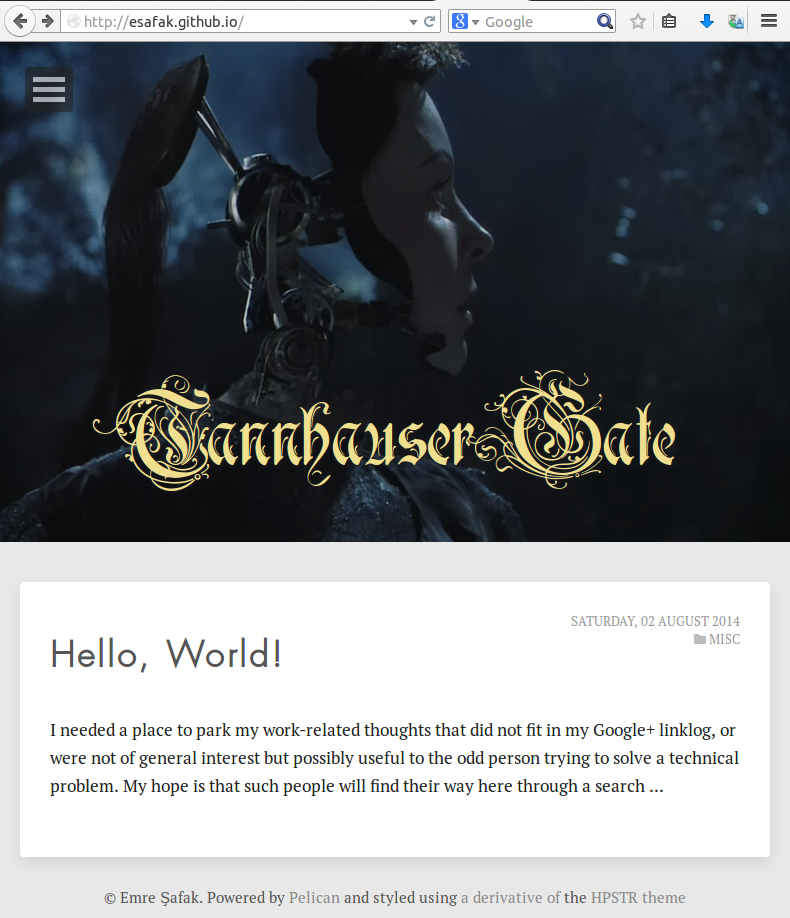

# HPSTR Pelican Theme

This is a port of the [HPSTR Jekyll theme](https://github.com/mmistakes/hpstr-jekyll-theme) by [Michael Rose](https://github.com/mmistakes) to the [Pelican](https://github.com/getpelican/pelican) static site generator.

## Example

[My blog](http://esafak.github.io/) :)



## Features

* Responsive templates for post, page, and post index. Looks great on mobile, tablet, and desktop devices.
* Graceful degradation in older browsers. Compatible with Internet Explorer 8+ and all modern browsers.
* Modern and minimal design.
* Sweet animated menu.
* Readable typography to make your words shine.
* Support for large images to call out your favorite posts.
* Social sharing links for Facebook, Twitter, and Google+, if you choose.
* [Open Graph metadata](http://ogp.me/) for SEO and [better embeds in social networks](https://developers.facebook.com/docs/opengraph/howtos/maximizing-distribution-media-content). Open Graph metadata support for images, videos, audio, etc. inside posts is a possible new feature.
* Google Web fonts.
* Comments with [Muut](http://muut.com/) or [Disqus](http://disqus.com/).

## Supported plugins

Pelican comes with additional plugins that you can install and activate for your website. For more information see the [pelican-plugins](https://github.com/getpelican/pelican-plugins) repository.

Here are the plugins that should work out of the box with that theme if enabled:

[related posts](https://github.com/getpelican/pelican-plugins/tree/master/related_posts)
: Displays related articles at the bottom of a blog post being read.

[i18n subsites](https://github.com/getpelican/pelican-plugins/tree/master/i18n_subsites)
: Extends the translations functionality by creating internationalized sub-sites for the default site. Also takes care of translating theme items.

  
## Installation

1. Clone this theme into your pelican's site theme directory
2. Update or create your site's ```pelicanconf.py``` configuration file:

``` python
#!/usr/bin/env python
# -*- coding: utf-8 -*- #

from __future__ import unicode_literals

# User info
AUTHOR = u'Your name'
AUTHOR_ABOUT = u'Your bio goes here. A sentence or two should suffice.'

SITENAME = u'Site Title'
SITEURL = ''

# Directories configuration
PATH = 'content'
ARTICLE_PATHS = ['posts']

# Any extra files should be added here
STATIC_PATHS = [
    'extra',
    'images'
]

EXTRA_PATH_METADATA = {
    'extra/robots.txt': {'path': 'robots.txt'}
}

# By default we enable pretty highlighing in markdown:
MD_EXTENSIONS = ['codehilite(css_class=highlight)', 'extra', 'toc']

# Pagination
DEFAULT_PAGINATION = 3

# Categories
USE_FOLDER_AS_CATEGORY = False
DEFAULT_CATEGORY = 'Misc'

# Plugin path
PLUGIN_PATHS = ['../pelican-plugins']
PLUGINS = ['related_posts', 'sitemap', 'i18n_subsites']

JINJA_EXTENSIONS = ['jinja2.ext.i18n']

# Theme
THEME = "theme/pelican-hpstr"

# Social account names/numbers
GITHUB = ''
GOOGLE = ''
STACKX = ''
TWITTER = ''
LINKEDIN = ''

# Social widgets
SOCIAL = (('github', 'https://github.com/'+GITHUB, 'GitHub'),
          ('twitter', 'http://twitter.com/'+TWITTER, 'Twitter'},
          ('google', 'https://plus.google.com/+' + GOOGLE, 'Google+'),
          ('linkedin', 'http://linkedin.com/in/'+LINKEDIN, 'LinkedIn'),
          ('stack-exchange', 'https://stackexchange.com/users/' + STACKX, 'Stack Exchange'),)
          
# Sitemap configuration
SITEMAP = {
    'format': 'xml',
    'priorities': {
        'articles': 0.5,
        'indexes': 0.5,
        'pages': 0.5
    },
    'changefreqs': {
        'articles': 'weekly',
        'indexes': 'daily',
        'pages': 'monthly'
    }
}

# I18n
I18N_TEMPLATES_LANG = 'en'

# Comments
ENABLE_DISQUS = False
ENABLE_MUUT = True

```


## Contact

Ping me on Twitter [@jonathan_dray](http://twitter.com/jonathan_dray) or [file a GitHub Issue](https://github.com/spiroid/pelican-hpstr/issues/new).


## License

As the original theme is licensed under the [GNU General Public License](https://github.com/mmistakes/hpstr-jekyll-theme/blob/master/LICENSE), I choose to distribute the Pelican version under the same conditions.

This theme is free and open source software, distributed under the [GNU General Public License](https://github.com/spiroid/pelican-hpstr/blob/master/LICENSE) version 2 or later. So feel free to to modify this theme to suit your needs.
